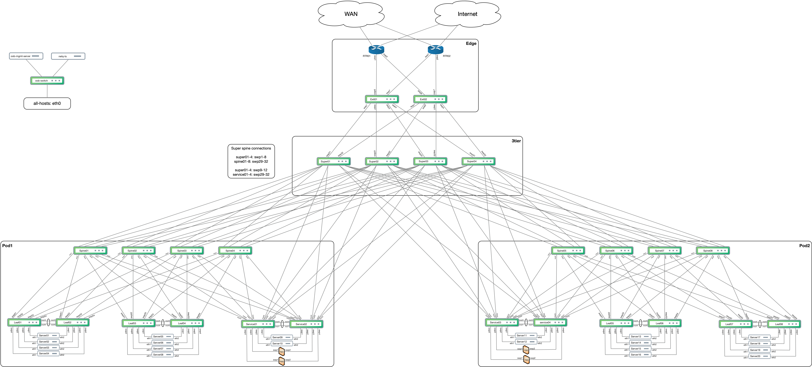

# Cumulus Putting It All Together demo

The PIAT demo was built as a PoC demo combining several technologies into a complete solution architecture. This documentation will explain how to setup the demo, deploy the architecture and a walk-through of the various components.

Table of Contents
=================
* [Introduction](#introduction)
* [Running the vagrant topology](#running-the-vagrant-topology)
* [Deploying the PIAT demo](#deploying-the-piat-demo)
* [Demo explanation](#demo-explanation)

Introduction
------------------------
One of the unique capabilities of Cumulus Linux is the possibility to completely virtualize the operating system. Compared to other network operating systems there is no additional layer necessary to forward packets, this is done by Linux kernel itself. This means that with Virtualbox, KVM or Vmware a topology of multiple nodes can be built. Such a topology can be used to test a solution in a sandboxed environment and forward packets that are handled in the same way as when Cumulus Linux is running on hardware. Traffic can be forwarded and all features can be tested in a complete copy of a production environment.

Cumulus networks had made a reference topology (CLdemo2, see below diagram) that is being used for multiple use-cases (e.g Cumulus in the Cloud). For the PIAT demo we are using a subset of the topology to demonstrate a complete solution architecture with multiple technologies that are available in Cumulus Linux and Cumulus NetQ. The demo consists of two parts:

* cldemo2, the topology made available in Vagrant
* PIAT demo, A combination of Ansible playbooks that deploys a real-world scenario on top of the topology

Running the vagrant topology
------------------------

Deploying the PIAT demo
------------------------

Demo explanation
------------------------
